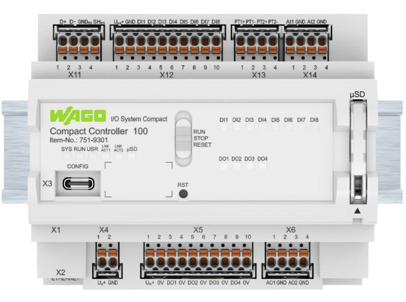

# CC100IO

Python Modul um zum Ansteuern der Ein- und Ausgänge des WAGO Compact Controller 100. Kann nativ auf dem Gerät oder in einem Dockercontainer genutzt werden.

## Mitwirkende
- Konrad Holsmoelle <konrad.holsmoelle@wago.com>
- Bjarne Zaremba <bjarne.zaremba@wago.com>
- Tobias Pape <tobias.pape@wago.com>
- Tobias Schaekel <tobias.schaekel@wago.com>
- Mattis Schrade <mattis.schrade@wago.com>
- Bekim Imrihor <bekim.imrihor@wago.com>
- Nele Stocksmeyer <nele.stocksmeyer@wago.com>
- Sascha Hahn <sascha.hahn@wago.com> 
- Danny Meihoefer <danny.meihoefer@wago.com>


## 1. Überblick Compact Controller 100
Der Compact Controller ist die neue Kompaktsteuerung von WAGO mit integrierten I/Os für kleinere Automatisierungslösungen.



- 8DI 4DO (24V)
- 2AI 2AO (0-10V)
- 2NI1K/PT1K
- 1RS485
- 2 x ETHERNET
- SD-Karte bis 32 GB
- Echtzeit-Linux
- Cortex A7; 650Mhz
- Programmiersprachen gemäß IEC 61131-3 (CoDeSys V3.5)
- RAM: 512 MB
- Flash: 4096 MB

Docker und Node-Red auf dem CC100 - https://www.youtube.com/@helmutsaal3215/videos


## 1. CC100 vorbereiten
Auf dem CC100 muss die Firmware Version 21(03.09.04) oder höher installiert sein.

### Feste IP auf USB-Ethernet-Adapter konfigurieren
1. Windowseinstellungen öffnen --> Netzwerk und Internet --> Adaptereinstellungen ändern
2. Rechtsklick auf USB-Adapter --> Eigenschaften
3. Doppelklick auf "internetprotokoll, Version 4"
4. IP-Adresse: 192.168.1.xx (z.B. 192.168.1.10)
5. Subnetzmaske: 255.255.255.0

### Temporäre IP auf CC100 konfigurieren
1. Betriebsartenschalter in STOP-Position
2. Reset-Taster (RST) länger als 8 Sekunden drücken
Die Ausführung wird durch eine orange blinkende „SYS“-LEDs signalisiert. Hiermit wurde dem CC100 die temporäre IP 192.168.1.17 zugewiesen.

### CC100 konfigurieren
1. Ethernetkabel an Steckplatz X1 des CC100
2. IP-Adresse des CC100 in Adressleiste des Webbrowser eingeben um auf das WBM zu gelangen
3. Anmeldedaten des CC100
    - Benutzer: admin
    - Kennwort: wago
4. Wenn Anfrage für Kennwortänderung angezeigt wird abbrechen
5. auf Startseite prüfen, ob Firmware Revision 21(03.09.04) oder größer ist
    - FW herunterladen (https://downloadcenter.wago.com/software/details/lftcm58nickznwfatc)
    - FW mit WagoUpload auf dem CC100 installieren (https://downloadcenter.wago.com/software/details/lhg5pfs6pnw13wzlpt)
6. feste IP Adresse einstellen
    - Configuration --> Networking
    - IP Source: Static IP
    - Static IP Adress kann auf 17 bleiben
    - Subnetzmaske kann bleiben
    - Submit
7. Uhrzeit einstellen (falls erforderlich)
    - Configuration --> Clock


### Installation von Python 3.7 auf dem CC100
Es befindet sich bereits eine Python Installation auf dem Gerät (Version 2.7). Es wird allerdings Version 3.7 benötigt.

1. IPK-Datei herunterladen (https://github.com/WAGO/cc100-howtos/blob/main/HowTo_AddPython3/packages/python3_3.7.6_armhf.ipk)
2. über das WBM Python installieren
    - Configuration --> Software Uploads
    - zuvor heruntergeladene IPK auswählen und installieren

## 2. Nutzung von Python auf dem CC100
Um Pythoncode auf dem CC100 schreiben und ausführen zu können, muss der Zugriff auf das Linux Betriebssystem auf dem Gerät
hergestellt werden können. Dafür bietet sich eine Verbindung über SSH an. SSH stellt eine verschlüsselte Verbindung in Form
eines Terminals zur Verfügung. Der CC100 unterstützt dies standardmäßig. Mac- und Linux-PCs unterstützen i.d.R. ebenfalls bereits SSH.
Auf Windows-Geräten muss zunächst ein SSH-Client installiert werden.

### SSH-Client auf Windows-PC installieren
1. Apps und Features öffnen --> Feature hinzufügen
2. SSH eingeben --> OpenSSH-Client installieren
3. Kommandozeile öffnen (cmd)

    ```bash
    ssh root@192.168.1.17 
    ```
    - password: wago
4. Python Installation prüfen

    ```bash
    python3
    ```

### Visual Studio Code auf dem PC installieren und konfigurieren
1. https://code.visualstudio.com/download
2. Python Extension installieren (ms-python.python)
3. SSH Client Extension installieren, z.B. thangnc.ssh-client
    - add Connection

### Python-Bibliothek zum Ansteuern der Ein- und Ausgänge installieren
1. Dieses Repository herunterladen
2. In das Verzeichnes des heruntergeladenen Repositories wechseln und Kommandozeile öffnen

    ```bash
    scp -pr ./python_scripts root@192.168.1.17:/home/
    ```

Nun können Pythonsscripts im Verzeichnis /home/python_scripts erstellt werden. Es muss lediglich das
CC100IO Modul im Pythonscript importiert werden.

```python
import CC100IO

# Python Code
```
Zum Ausführen der Scripts in das Verzeichnis /home/python_scripts wechseln und das gewünschte Script mit Python 3 ausführen.

```bash
cd /home/python_scripts

pyhon3 <script_name.py>
```

## Funktionen

* #### ```digitalWrite (value, output)``` :
  * value: Value which the selected output should be set to (True or False)
  * output: Digital output to be switched (1-4)
  * Function switches the output to the specified value.
  * Function does not check the current value of the output.
  * Function returns True if value is written, returns False if an error occured. 
* #### ```digitalRead (input)``` :
  * input: Digital input to be read (1-8)
  * Function reads the input. 
  * Function does not check the current value of the output. 
  * Returns True or False depending on the value.
* #### ```digitalReadWait (input, value)``` :  
  * input: Digital input to be checked (1-8)
  * value: State to be queried at the input
  * Reads the specified input until the desired state is reached, by another Function or external factors and then returns True.
  * Function runs until the state is reached.
* #### ```analogWrite (voltage, output)``` : 
  * voltage: Voltage which the selected output should be set to (0 - 10000 mV)
  * output: Analog output to be switched(1 or 2)
  * Function switches the output to the specified voltage. 
  * Function does not check the current value of the output. 
  * Function returns True if value is written, returns False if an error occured. 
* #### ```analogRead (input)``` :
  * input: Analog input to be read (1 or 2)
  * Function reads the input and returns the calibrated value in mV as an Integer.
* #### ```delay (iTime)``` :
  * Function makes the programm in a period of time late or slow. (in ms)
* #### ```tempRead (input)``` :
  *  input: PT input to be switched ("PT1" or "PT2")
  *  Function reads the input and returns the calibrated value in °C as an Integer.

## Beispiele
Befinden sich im Ordner *python_scripts*


